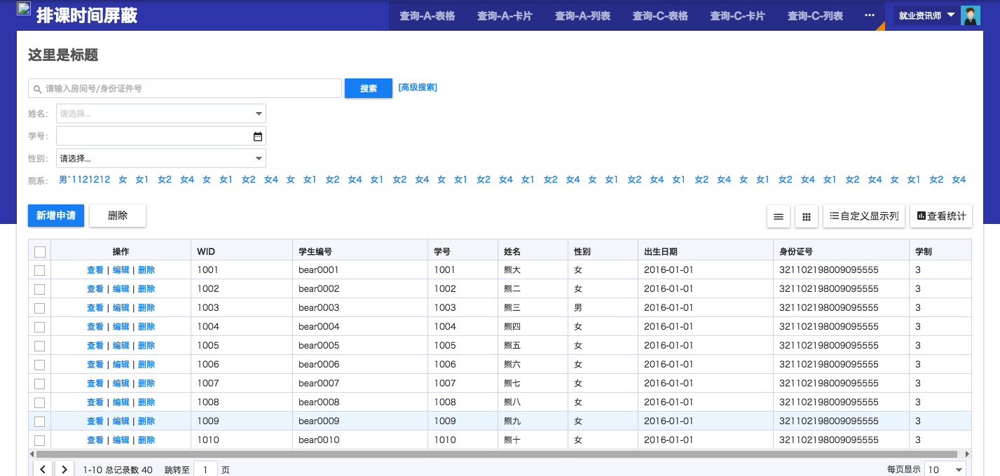
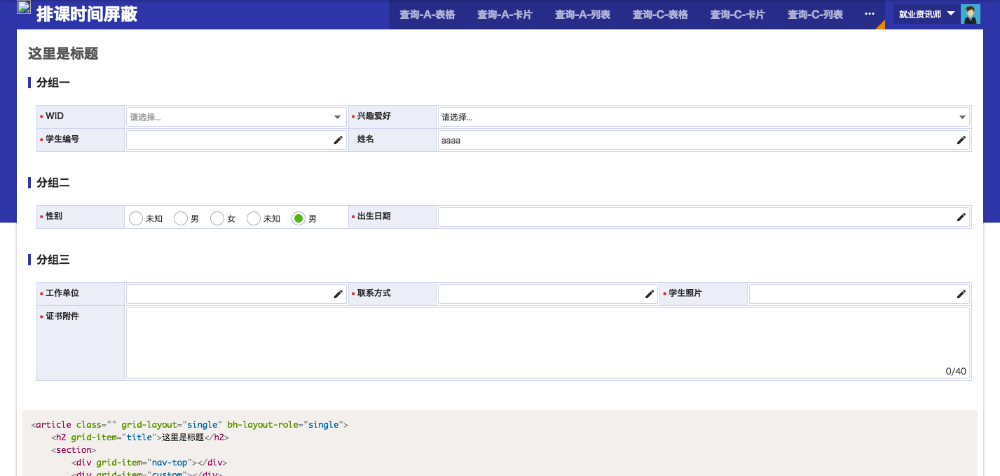
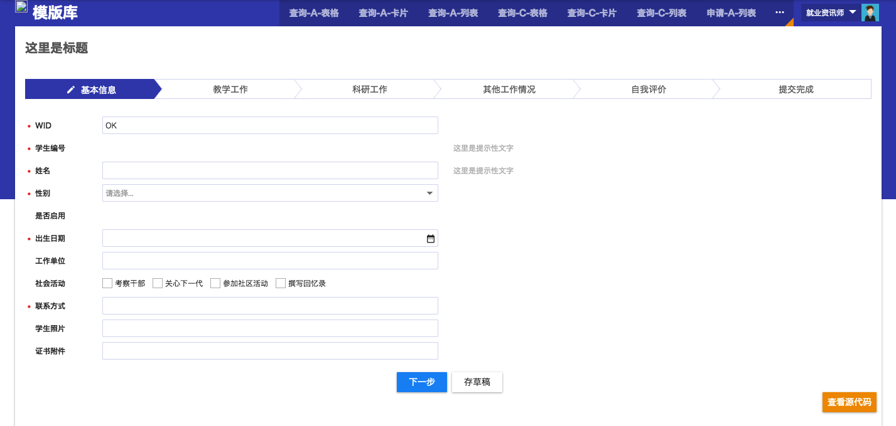

# 场景模板页

<table>
	<tr>
		<td>
			
			查询-A-表格
		</td>
		<td>
			
			查询-A-卡片
		</td>
	</tr>
	<tr>
		<td>
			
			查询-A-列表
		</td>
		<td>
			
			查询-C-表格
		</td>
	</tr>
	<tr>
		<td>
			
			申请-A-列表
		</td>
		<td>
			
			申请-A-表格详情
		</td>
	</tr>
	<tr>
		<td>
			
			查询-C-卡片
		</td>
		<td>
			
			查询-C-列表
		</td>
	</tr>
	<tr>
		<td>
			
			统计-A-饼图
		</td>
		<td>
			
			统计-A-柱状图
		</td>
	</tr>
	<tr>
		<td>
			
			申请-E-混合表单
		</td>
		<td>
			
			申请-C-表单详情+步骤导航
		</td>
	</tr>
</table>
