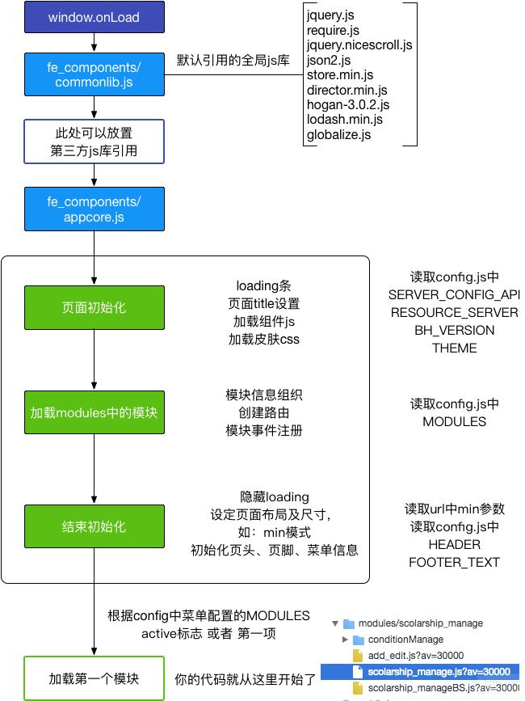

# ubase 应用快速开发框架

## Table of contents

* [前端基础入门](#starting)
* [准备工作](#prepare)
* [快速入门](#quick-start)
* [规则约定](#rule)
* [路由参数](#route-params)
* [子页面](#sub-page)
* [公共页面](#common-page)
* [路由参数](#route-params)
* [echarts图表](#echarts)
* [APP嵌入模式](#embed)
* [config.js配置项说明](#config)
* [utils方法列表](#utils)
* [技术选型](#technology)
* [常见问题](#faq)

## ubase 框架做了些什么？



## 准备工作
* 安装nodejs环境 -[for windows](https://res.wisedu.com/FS/tools/node-v5.6.0-x64.msi) | -[for mac](https://res.wisedu.com/FS/tools/node-v6.3.0.pkg)
* 设置npm国内镜像，命令行执行: `npm config set registry https://registry.npm.taobao.org`
* 安装基础库，命令行执行：`npm install -g gulp yo`
* 安装ubase脚手架，命令行执行：`npm install -g generator-um`
* 下载[node_modules.zip](https://res.wisedu.com/FS/tools/node_modules.zip)并解压到代码所在盘的根目录
* 下载[sublime text3](https://res.wisedu.com/FS/tools/sublime%20text%20new.zip)前端编辑器，解压后直接使用，无需安装

## 快速入门

* 生成APP目录结构，进入项目待存放目录，打开命令行执行：yo um，选择ubase选项->输入项目名称->回车
* 生成APP页面， 进入第一步生成的modules文件夹，打开命令行执行：yo um，选择页面类型->输入页面名称（名称由字母组成）->回答是否纸质弹框页面->回车

```
* 在config.js中配置modules.
```javascript
"MODULES": [{
      title: "模块名称",
      route: "modulename"
    }]
```
* 当前目录命令行下执行gulp命令.
* 打开浏览器进入 http://localhost:9001 查看.

## 规则约定

### 应用目录结构
```
app/
├── modules/
│   ├── modules1/
│   │   ├── modules1.css
│   │   ├── modules1.js
│   │   ├── modules1BS.js
│   │   ├── modules1IndexPage.html
│   │   └── ···
│   ├── modules2/
│   │   ├── modules2.css
│   │   ├── modules2.js
│   │   ├── modules2BS.js
│   │   ├── modules2IndexPage.html
│   │   └── ···
│   └── ···/
├── public/
│   ├── css/
│   │   ├── base.css
│   │   └── style.css
│   └── images/
│       └── ···
├── config.js
└── index.html
```
一个模块至少存在 目录名.js 目录名BS.js 目录名IndexPage.html 三个文件，如需定制样式可以自行添加 目录名.css，模板文件的命名规则：目录名+自定义名称+Page.html

### 事件绑定方式
模块中的所有事件处理都通过eventMap来维护，eventMap中key为jquery选择器，value为绑定的事件处理函数，默认绑定的是click事件，如需绑定其他事件，可以在key后@相应的事件. 在事件处理函数中可通过event.currentTarget获取到对应的dom元素
```javascript
eventMap: function() {
    return {
        "#retirementInfoTable .j-row-edit": this.editCb,
        "#advancedQueryPlaceholder@search": this.searchCb,
        ".index-tip@mouseover": this.mouseoverCb
    };
},
```
```javascript
editCb: function(event){
  var wid = $(event.currentTarget).attr('data-x-wid');//通过这种方式可以给事件传递参数
}
```

### 异步数据获取方式

目录名BS.js主要负责与后端API交互并进行数据处理, 异步请求使用jquery的Deferred对象做链式处理。
```javascript
getStudentInfo: function(params) {
    var def = $.Deferred();

    utils.doAjax(bs.api.studentInfoUrl, null, 'get').done(function(res) {
        // 这里可以对返回的数据做些处理
        def.resolve(res);
    }).fail(function(res) {
        def.reject(res);
    });

    return def.promise();
}
```
### 路由跳转
utils.goto实现路由跳转，第一个参数为跳转后的路由，如果需要在新的tab页打开，则第二个参数置为true
```javascript
utils.goto('module1/detail/1', true);
```

### 页脚位置置底
在页面中插入html的时候，如果需要重置页面的页脚位置，可以将html方法的第二个参数置为true
```javascript
this.$rootElement.html(mainView.render(), true);
```

## 路由参数

路由参数采用restful风格，一般在路由跳转或新开浏览器tab页的时候使用
```javascript
initialize: function() {
    var routeParams = this.getRouterParams();
    var type = routeParams[0];
    var id = routeParams[1];

    switch (type) {
        case 'preview':
            this.initPreviewPage(id);
            break;
        case 'check':
            this.initCheckPage(id);
            break;
        default:
            this.initIndexPage();
    }
},
```

## 子页面

纸质弹窗、步骤条中的每个step以及业务上独立的页面需要写入单独的子页面文件夹（包括js,bs,css,html，如果有都要独立），如果子页面中还包含子页面，则在子页面的文件夹中再嵌套其子页面的文件夹。子页面在使用前需要通过pushSubView注册，子页面使用的入口方法为initialize方法, 子页面中有属性parent指向主页面。

## 公共页面

如果某个子页面在多个模块中都有用到，则需要将其放到public/commonpage/文件夹下，然后在需要使用该子页面的模块中require该子页面即可。

## echarts图表
统一通过utils.getEcharts()获取echarts对象，然后做后续图表初始化
```javascript
utils.getEcharts().done(function(ec) {
    var myChart = ec.init($obj);//$obj为原生dom对象
    myChart.setOption(option);
});
```

## APP嵌入模式
如果app是通过iframe的方式嵌入的，而且嵌入后希望隐藏APP的header和footer，只显示中间内容区域，则在url中添加min=1参数（注意：该参数需要在#路由前添加）如：
```html
https://res.wisedu.com/FE/HRMS/个人填报单页版/index.html?min=1#/txsbb
```

## config.js配置项说明
```javascript
{
    "FE_DEBUG_MODE": true, // 前端部门开发模式, 业务线对接后端真实接口时，删除该配置项
    "DEBUG_MODE": true, // 业务线转侧时删除该配置项（注：目前未使用）
    "RESOURCE_SERVER": "https://res.wisedu.com", //  资源服务器地址
    "THEME": "blue", // 主题 blue purple
    'APP_ENTRY': "", // APP默认路由
    "APP_TITLE": "教职工招聘审核", // APP标题
    "FOOTER_TEXT": "", // 应用底部说明文本
    "APP_VERSION": "", // app的版本号 防止前端业务js和html文件缓存
    "SERVER_CONFIG_API": "", // 服务器端生成配置的api 返回的数据会覆盖config.js中相同的配置项
    "MINI_MODE": true, // 只显示主体部分内容， 去除页头和页脚 默认false
    "HIDE_NAV":true, // 隐藏导航菜单 默认false
    "RELEASE_MODE": false, // 执行gulp build后，前端业务代码统一压缩打包成all.css和packege.js，需要在index.html手动引用这2个文件  然后配置该参数为true， 发布后如果需要看到单独的文件调试：执行 store.session('debug',  true) 刷新页面即可看到非压缩的文件
    "MODULES": [{ // 需要展示的模块
        title: "体检管理", // 模块名称
        route: "tjgl",// 模块路由 url和route二选一
    }, { 
        title: "笔试", 
        url:'http://www.baidu.com' // 配置url时，点击会在新tab页中打开， url和route二选一
    }, {
        title: "面试",
        route: "mianshi",
        buttons:['addbutton','deletebuton'] // 按钮级授权 （html中需要授权控制的按钮上添加属性data-auth，如<button data-auth="addbutton">添加</button>）
    }, {
        title: "招聘录用",
        route: "zply",
        hide: true // 配置该模块是否在页面中显示
    }, {
         title: "学校审核",
         route: "sh/xxsh", // 多个模块可以复用同一份代码
     }, {
          title: "学院审核",
          route: "sh/xysh",// 多个模块可以复用同一份代码
      }],
    "CONFIG_READY": function(config){ // 对配置的config在使用前通过该回调干预做进一步处理
        ... 
    },
    "THIRD_PARTY_PLUGIN": { // 配置第三方公共模块
        'jquery': 'http://cdn.bootcss.com/jquery/3.1.1/jquery.js',
        'hrmsUtils': './hrmsUtils.js'
    },
    "AFTER_FRAMEWORK_INIT": function(){ // 外层框架初始化结束，进入模块前执行的回调
    
    },
    "HEADER": {// 头部配置
        "dropMenu": [{
            "text": "就业资讯师",
            "active": true
        }, {
            "text": "就业管理人员"
        }],
        "logo": "./public/images/logo.png",
        "icons": ["icon-apps"],
        "userImage": "./public/images/user.png",
        "userInfo": {
            "image": "https://res.wisedu.com/scenes/public/images/demo/user1.png",
            "info": [
                "01118888",
                "张晓明  男",
                "南京理工大学  信息化办公室",
                "zhangxm@wisedu.com",
                "18888888888"
            ],
            "logoutHref": "javascript:void(0);"
        }
    }
}
```

## utils方法列表
* utils.loadCompiledPage('indexPage', require) // 加载html模版 返回的为模版编译后的对象（第二个参数设置为require时， html使用的是相对当前js的相对路径）
* utils.getEcharts() // 详见上面echarts图表
* utils.fetch(options) // ajax请求方法
* utils.dialog(options) // 警告提示框
* utils.window(options) // 对话框
* utils.getUserParams() // 后去url后面的参数
* utils.getConfig(key) // 获取config.js中的参数值
* utils.go(path, blank) // 路由调转 当blank为true时在新tab页打开
* utils.refreshButtonAuth() // 刷新按钮级授权（配合config.js中modules下的buttons使用）

## 技术选型

* 模块化：requirejs
* 路由：Director
* 模板引擎：Hogan.js from Twitter [语法参考Mustache](http://www.jianshu.com/p/7f1cecdc27e1) 
* 图表：echarts [example](http://echarts.baidu.com/examples.html)
* 工具库：lodash [API Documentation](https://lodash.com/docs)
* 滚动条美化：jquery.nicescroll
* 组件库：jqxWidgets [Documentation](http://www.jqwidgets.com/jquery-widgets-documentation/)


